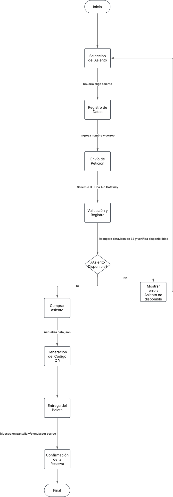
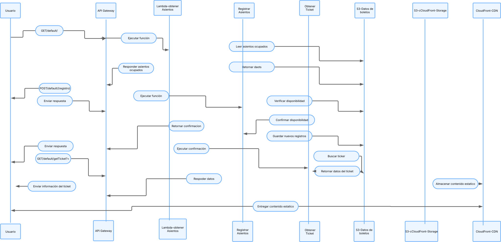
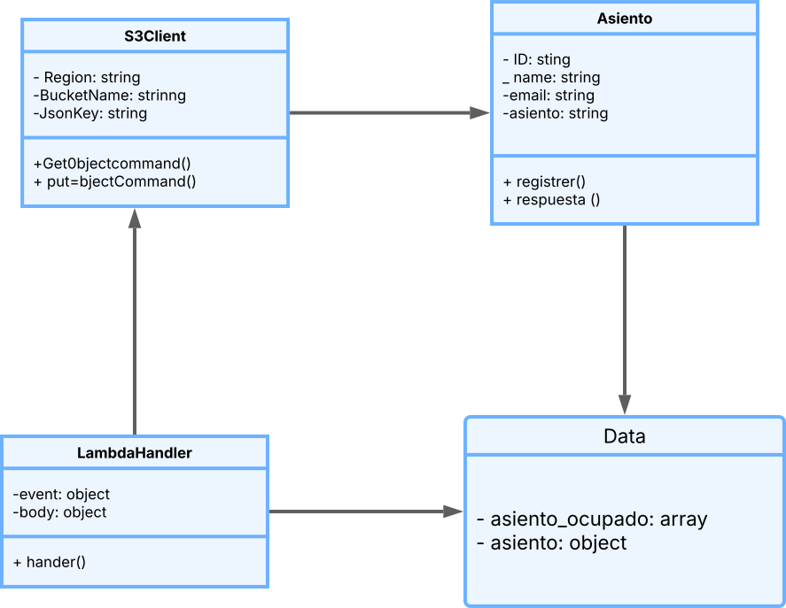

# La Nube

[Boletera en Línea](http://daquh13zx2ys8.cloudfront.net/)

El presente documento detalla el desarrollo de una boletera en línea, un sistema basado en la nube que permite a los usuarios seleccionar un asiento, registrar su información personal y obtener un código QR que confirma la transacción. Este sistema se apoya en los servicios de Amazon Web Services (AWS) para garantizar escalabilidad y disponibilidad. La finalidad del proyecto es agilizar la compra y gestión de boletos de manera eficiente y segura.
Arquitectura del Sistema:
El sistema está compuesto por varios servicios interconectados que garantizan su correcto funcionamiento:

**Interfaz Web**: Diseñada para ser intuitiva y responsiva, permitiendo a los usuarios seleccionar asientos disponibles y completar la compra.

# Amazon web services
  - Cloudfront:

-	API Gateway: Gestiona y canaliza las solicitudes HTTP, asegurando que las peticiones sean enrutadas correctamente a las funciones Lambda correspondientes.
-	Funciones Lambda: Procesan las solicitudes del usuario, verifican la disponibilidad de asientos, registran la información de compra y generan los códigos QR.
-	S3 (Amazon Simple Storage Service): Almacena el archivo data.json, el cual mantiene un registro actualizado de los asientos ocupados y la información de los compradores.
Funcionamiento Técnico:

El proceso de compra y registro sigue un flujo bien definido:
1.	Selección del Asiento: El usuario accede a la interfaz web y elige un asiento disponible en el mapa de ubicaciones.
2.	Registro de Datos: Se le solicita ingresar su nombre y correo electrónico para completar la reserva.
3.	Envío de Petición: La información se envía mediante una solicitud HTTP a API Gateway, que redirige la petición a la función Lambda.
4.	Validación y Registro: La función Lambda recupera el archivo data.json de S3, verifica la disponibilidad del asiento y, en caso de estar libre, genera un identificador único (UUID) para la compra.
5.	Almacenamiento en S3: Se actualiza el archivo data.json con la nueva información.
6.	Generación del Código QR: Una vez confirmada la compra, el sistema genera un código QR asociado al identificador de la transacción.
7.	Entrega del Boleto: Se muestra en pantalla y/o se envía por correo el código QR con la confirmación de la reserva.

Código:

El código de las funciones Lambda está estructurado de la siguiente manera:
1.	Conexión con AWS S3 (Amazon Simple Storage Service): Se utiliza AWS SDK (Amazon Web Services Software Development Kit) para recuperar y modificar el archivo data.json.
2.	Lectura de Datos: Se extrae la información actual de asientos ocupados y compradores.
3.	Procesamiento de la Solicitud: Dependiendo del tipo de petición (GET o POST), se realiza una operación de lectura o escritura.
4.	Generación de Respuesta: Se devuelve una respuesta JSON indicando el estado de la transacción.
5.	Actualización de la Base de Datos: En caso de compra, se guarda la información del usuario y se bloquea el asiento seleccionado.


El sistema de boletera en línea implementado es robusto, escalable y seguro. Gracias a la infraestructura serverless de AWS, se garantiza un alto nivel de disponibilidad y rendimiento. La documentación exhaustiva de APIs, junto con el análisis del código y los diagramas UML, facilitan su mantenimiento y futura extensión. Se recomienda futuras mejoras en autenticación de usuarios y optimización de almacenamiento de datos.

## Diagramas UML

**Diagrama de flujo:**




**Diagrama de Secuencia:**




**Diagrama de Clases:**




# Base de datos JSON
Se guarda en **data.json** en bucket **boleteradata**

```json
{
    "asientos_ocupados": [
        15,
        20,
        22
    ],
    "asientos": {
        "asiento_15": {
            "id": "OSsjU54655DnKIsklsSJkjs157sd6",
            "name": "Jose Eduardo Muñoz",
            "email": "joseeduardo@example.com"
        },
        "asiento_20": {
            "id": "c5be1b3f-613a-4d60-8036-63c7adbd6433",
            "name": "Manuel Antonio Gallardo",
            "email": "manuel@example.com"
        },
        "asiento_22": {
            "id": "fc37cb2e-1a8c-46c4-9bd8-bccfde244703",
            "name": "Jimena Garcia",
            "email": "jimenag@example.com"
        }
    }
}
```


# API Documentation

## Obtener asientos  ocupados

```http
GET /default/ HTTP/1.1
Host: hfxwfbvgsg.execute-api.us-east-1.amazonaws.com
```
### Respuesta en body

```json
{
  "asientos_ocupados": [15,20,22]
}
```
### Codigo lambda
```javascript
import { S3Client, GetObjectCommand, PutObjectCommand } from "@aws-sdk/client-s3";
import { Readable } from "stream";

const s3 = new S3Client({ region: "us-east-1" });
const bucketName = "boleteradata";
const jsonKey = "data.json";


export const handler = async (event) => {
    const getObjectCommand = new GetObjectCommand({ Bucket: bucketName, Key: jsonKey });
    const response = await s3.send(getObjectCommand);
    
    const streamToString = (stream) =>
    new Promise((resolve, reject) => {
      const chunks = [];
      stream.on("data", (chunk) => chunks.push(chunk));
      stream.on("end", () => resolve(Buffer.concat(chunks).toString("utf-8")));
      stream.on("error", reject);
    });

    const fileContent = await streamToString(response.Body);
    let data = JSON.parse(fileContent);
    
    const asientos_ocupados = {
      "asientos_ocupados": data.asientos_ocupados
    }

    return {
      statusCode: 200,

      body: JSON.stringify(asientos_ocupados),
      headers: {
        "Content-Type": "application/json",
        "Access-Control-Allow-Origin": "*",
        "Access-Control-Allow-Methods": "OPTIONS,POST,GET",
      },
    };
};

```

---

## Enviar un nuevo registro 

```http
POST /default/ HTTP/1.1
Host: hfxwfbvgsg.execute-api.us-east-1.amazonaws.com
Content-Type: application/json
Content-Length: 96

{
    "asiento": "asiento_20",
    "name": "Juan vidales",
    "email": "juan@example.com"
}
```
### Respuesta en body
```json
{
    "disponibilidad": false,
    "id": "ef87ec8a-e0e1-4705-ab26-068ce5286517"
}
```
En caso que no se encuentre el **id**  lo regresa vacio

### Codigo lambda
```javascript
import { S3Client, GetObjectCommand, PutObjectCommand } from "@aws-sdk/client-s3";
import { Readable } from "stream";
import { randomUUID } from 'crypto';


const s3 = new S3Client({ region: "us-east-1" });
const bucketName = "boleteradata";
const jsonKey = "data.json";


export const handler = async (event) => {
  let body = {};

  if (event.body) {
      body = JSON.parse(event.body);
  }

  const getObjectCommand = new GetObjectCommand({ Bucket: bucketName, Key: jsonKey });
  const response = await s3.send(getObjectCommand);
    
  const streamToString = (stream) =>
  new Promise((resolve, reject) => {
    const chunks = [];
    stream.on("data", (chunk) => chunks.push(chunk));
    stream.on("end", () => resolve(Buffer.concat(chunks).toString("utf-8")));
    stream.on("error", reject);
  });

  const fileContent = await streamToString(response.Body);
  let data = JSON.parse(fileContent);

  var registrer = (name, email, asiento) => {
    let intAsiento = parseInt(asiento.split("_")[1]);
    let body_respuesta = {disponibilidad : false, id:""}
      
    if (data.asientos_ocupados.includes(intAsiento)) {
      return body_respuesta
    }
    
    body_respuesta.id = randomUUID();
    
    data.asientos_ocupados.push(intAsiento);
      
    data.asientos[asiento] = {
      id: body_respuesta.id,
      name: name,
      email: email
    };
    
    return body_respuesta;
  }
    
  var { name, email, asiento } = body;
  
  const respuesta = registrer(name, email, asiento)

  const putObjectCommand = new PutObjectCommand({
      Bucket: bucketName,
      Key: jsonKey,
      Body: JSON.stringify(data, null, 4),
      ContentType: "application/json"
    });

  await s3.send(putObjectCommand);

  return {
    statusCode: 200,
    body: JSON.stringify(respuesta),
    headers: {
      "Content-Type": "application/json",
      "Access-Control-Allow-Origin": "*",
      "Access-Control-Allow-Methods": "OPTIONS,POST,GET",
    },
  };
};
```


## Peticicion para obtener el la informacion del ticket

```http
GET /default/getTicket?id=OSsjU54655DnKIsklsSJkjs157sd6 HTTP/1.1
Host: hfxwfbvgsg.execute-api.us-east-1.amazonaws.com
```

### Respuesta en body

```json
{
  "id": "OSsjU54655DnKIsklsSJkjs157sd6",
  "name":"Jose Eduardo Muñoz",
  "email":"joseeduardo@gmail.com"
  "asiento":"asiento_15",
}
```
### Codigo lambda
```javascript
import { S3Client, GetObjectCommand, PutObjectCommand } from "@aws-sdk/client-s3";
import { Readable } from "stream";

const s3 = new S3Client({ region: "us-east-1" });
const bucketName = "boleteradata";
const jsonKey = "data.json";


export const handler = async (event) => {
    const getObjectCommand = new GetObjectCommand({ Bucket: bucketName, Key: jsonKey });
    const response = await s3.send(getObjectCommand);
    
    const streamToString = (stream) =>
    new Promise((resolve, reject) => {
      const chunks = [];
      stream.on("data", (chunk) => chunks.push(chunk));
      stream.on("end", () => resolve(Buffer.concat(chunks).toString("utf-8")));
      stream.on("error", reject);
    });

    const fileContent = await streamToString(response.Body);
    let data = JSON.parse(fileContent);

    const queryParams = event.queryStringParameters || {};

    const respuesta = (id) => {
        if (!id) {
            return event.queryStringParameters;
        }

        for (let asiento in data.asientos) {
            if (data.asientos[asiento].id === id) {
                return {
                    id: data.asientos[asiento].id,
                    name: data.asientos[asiento].name,
                    email: data.asientos[asiento].email,
                    asiento
                };
            }
        }

        return { id: `${id} no encontrado` }; 
    };

    const req = respuesta(queryParams.id);

    
    return {
      statusCode: 200,
      body: JSON.stringify(req),
      headers: {
        "Content-Type": "application/json",
        "Access-Control-Allow-Origin": "*",
        "Access-Control-Allow-Methods": "OPTIONS,POST,GET",
      },
    };
};
```
